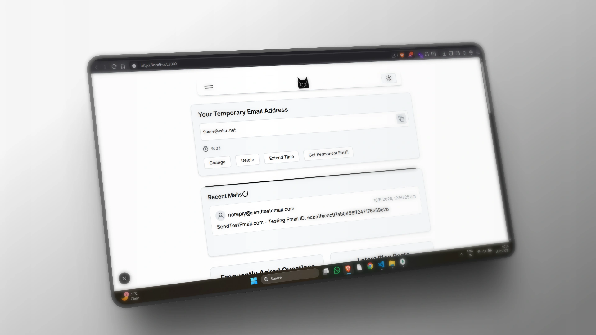
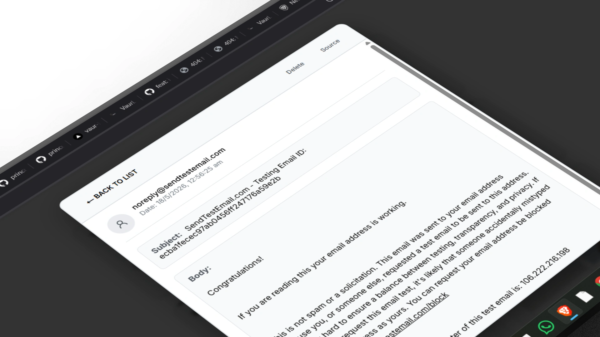
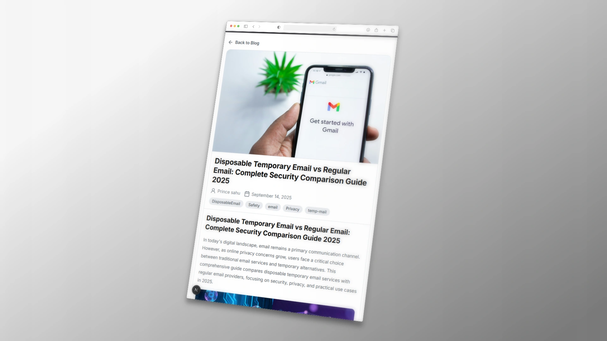
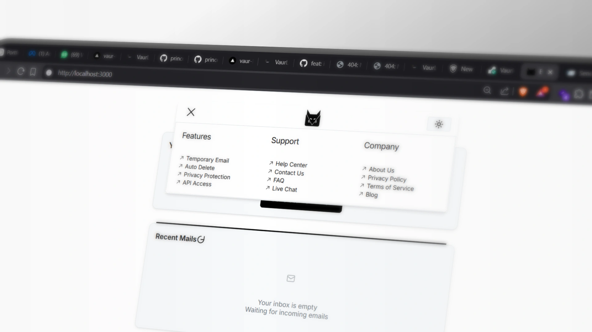
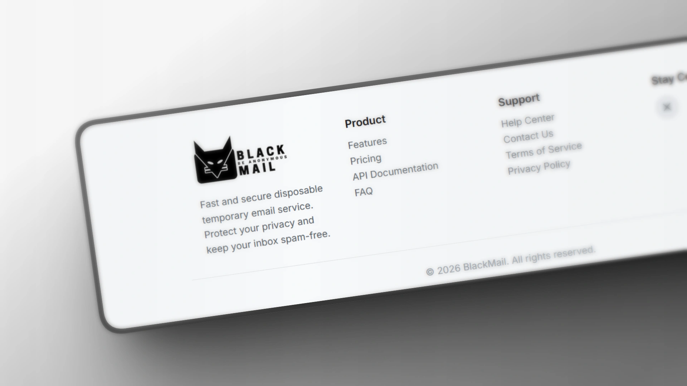
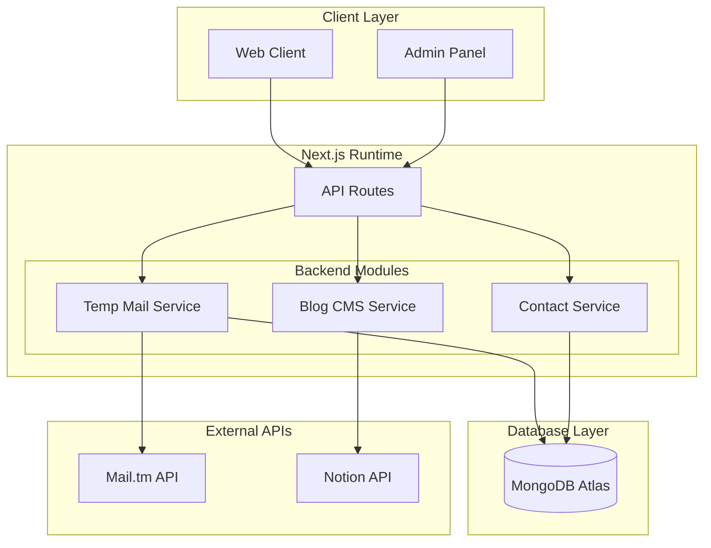
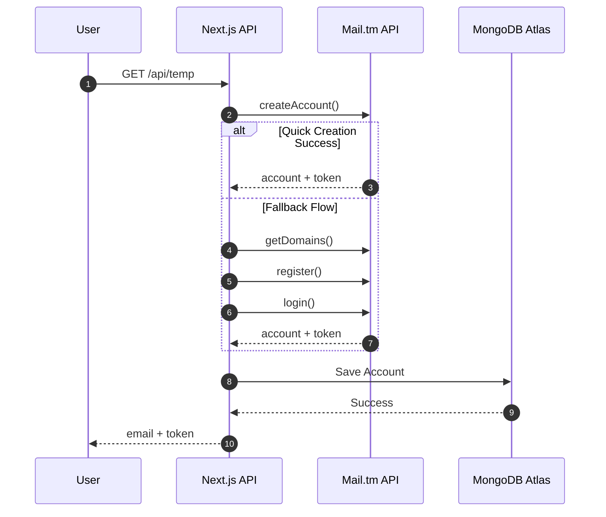
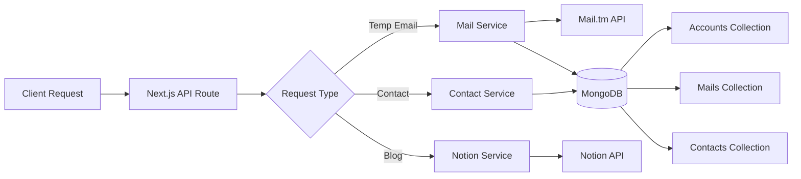

# BlackMail

> **Fast, Secure, and Anonymous Disposable Temporary Email Service**  
> Built with Next.js 14 (App Router), TypeScript, Tailwind CSS, MongoDB, and Notion API.

<p align="center">
  <a href="https://blackmail.pcodes.tech"><strong>Live Demo</strong></a> •
  <a href="https://www.linkedin.com/posts/princesahu7z_buildinpublic-nextjs-reactjs-activity-7393520305161457664-t2Id"><strong>Watch Demo on LinkedIn</strong></a>
</p>

---

## Interface & Showcase

<p align="center">
  
</p>

<table align="center">
  <tr>
    <td width="50%">
      <h4 align="center">Real-time Inbox & Message Viewer</h4>
      
    </td>
    <td width="50%">
      <h4 align="center">Notion-Powered Blog</h4>
      
    </td>
  </tr>
  <tr>
    <td width="50%">
      <h4 align="center">Interactive Navigation Menu</h4>
      
    </td>
    <td width="50%">
      <h4 align="center">Overview & Dual Layout</h4>
      
    </td>
  </tr>
</table>

<p align="center">
  
</p>

---

## Key Features

- **Instant Email Generation** — Create disposable email addresses instantly with zero sign-up or registration.
- **Privacy-First Architecture** — Protect your real email address from spam, trackers, and phishing attempts.
- **Real-Time Auto Refresh** — Receive incoming emails instantly with visual notifications.
- **Countdown Timer** — Interactive expiration timer with extended session options.
- **Dark & Light Mode** — Seamless theme toggle with persistent preferences.
- **Headless CMS Integration** — Fully dynamic blog system backed by Notion API.
- **Fully Responsive** — Beautiful UI optimized for desktop, tablet, and mobile devices.

---

## Architecture & System Design

### 1. System Layer Overview


### 2. Temporary Email Generation Flow


### 3. Request Routing & Data Pipeline


---

## Tech Stack

| Category | Technology |
|---|---|
| **Framework** | [Next.js 14](https://nextjs.org/) (App Router) |
| **Language** | [TypeScript](https://www.typescriptlang.org/) |
| **Styling** | [Tailwind CSS 4](https://tailwindcss.com/) |
| **Email Protocol / API** | [Mail.tm API](https://mail.tm/) (`@cemalgnlts/mailjs`) |
| **Database** | [MongoDB Atlas](https://www.mongodb.com/cloud/atlas) |
| **Headless CMS** | [Notion API](https://developers.notion.com/) |
| **Deployment** | [Vercel](https://vercel.com/) / [Render](https://render.com/) |

---

## Project Structure

```
tempus/
├── app/
│   ├── api/              # API routes (temp email, blog, contact)
│   │   ├── blog/         # Notion CMS blog endpoints
│   │   └── temp/         # Temporary email generation & management
│   ├── blog/             # Notion blog rendering pages
│   ├── components/       # UI components (Dialog, ThemeProvider, Toast, etc.)
│   ├── links/            # Resource links page
│   ├── globals.css       # Global CSS & Tailwind custom styles
│   ├── layout.tsx        # Root layout & providers
│   └── page.tsx          # Main application homepage
├── public/               # Static web assets & icons
└── BlackMail/            # Documentation screenshots & mermaid diagrams
```

---

## Getting Started

### Prerequisites
- **Node.js**: `18.x` or higher
- **Package Manager**: `npm`, `yarn`, `pnpm`, or `bun`

### Installation

1. **Clone the repository**
   ```bash
   git clone https://github.com/prince7z/tempus.git
   cd tempus
   ```

2. **Install dependencies**
   ```bash
   npm install
   ```

3. **Configure Environment Variables** (Optional for Notion CMS & MongoDB)
   Create a `.env.local` file in `tempus/`:
   ```env
   NOTION_API_KEY=your_notion_api_key
   NOTION_DATABASE_ID=your_notion_database_id
   MONGODB_URI=your_mongodb_connection_string
   ```

4. **Run Development Server**
   ```bash
   npm run dev
   ```
   Open [http://localhost:3000](http://localhost:3000) in your browser.

5. **Build for Production**
   ```bash
   npm run build
   npm start
   ```

---

## API Endpoints

### Temporary Mail Routes
- `GET /api/temp` — Generates a new temporary email account and returns credentials/JWT token.

### Blog Routes (Notion Integration)
- `GET /api/blog` — Fetches list of published blog posts from Notion database.
- `GET /api/blog/[id]` — Fetches detailed content for a single blog post.

---

## License & Acknowledgments

Distributed under the MIT License. Built with passion for privacy and seamless developer user experiences.
